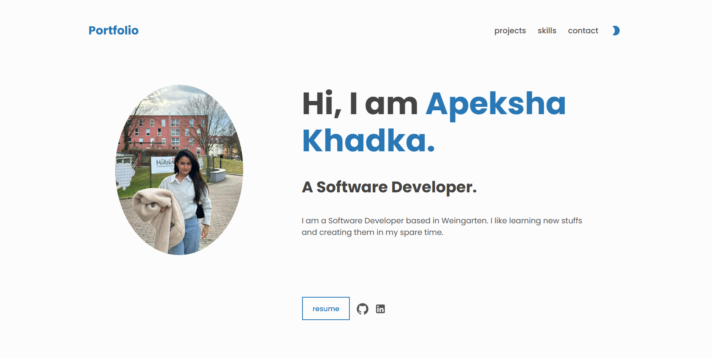

**PORTFOLIO**

In the project directory, you can run:

 `npm  install` : Downloads all the dependencies.\
 `npm start` : Runs the app in the development mode.

Opens http://localhost:3000 to view it in the browser. 
The browser is redirected to:
 